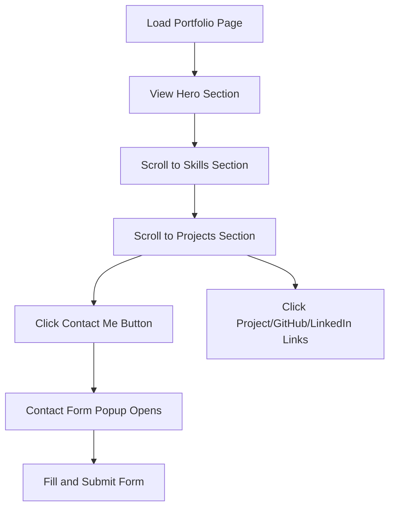

## 1. Product Overview
Modern one-page portfolio website for a software developer showcasing skills, projects, and professional information. The portfolio features a clean, professional design with smooth animations and responsive layout.

Target audience: Potential employers, clients, and professional connections seeking to evaluate the developer's skills and experience.

## 2. Core Features

### 2.1 User Roles
This is a public portfolio website with no user authentication required. All visitors have the same viewing permissions.

### 2.2 Feature Module
The portfolio consists of the following main sections on a single page:
1. **Hero Section**: Personal introduction with name, title, and brief bio
2. **Skills Section**: Programming languages and technologies showcase
3. **Projects Section**: Project cards with descriptions and links
4. **Contact Section**: Contact form popup with professional links

### 2.3 Page Details
| Page Name | Module Name | Feature description |
|-----------|-------------|---------------------|
| Portfolio Page | Hero Section | Display developer name, professional title, brief introduction, and professional headshot/avatar with smooth fade-in animation |
| Portfolio Page | Skills Showcase | Show programming languages and technologies as interactive cards with hover effects and icons |
| Portfolio Page | Projects Gallery | Display project cards with project name, description, technologies used, GitHub link, and live demo link |
| Portfolio Page | Contact Form Popup | Modal popup with contact form including name, email, subject, message fields and professional social links (GitHub, LinkedIn) |
| Portfolio Page | Navigation | Smooth scrolling navigation between sections with active section highlighting |
| Portfolio Page | Footer | Copyright information and quick links |

## 3. Core Process
User visits the portfolio page and can:
1. View hero section with personal introduction
2. Scroll to view skills and technologies
3. Browse through project cards
4. Click "Contact Me" button to open contact form popup
5. Fill and submit contact form
6. Click on GitHub/LinkedIn/project links to navigate to external sites

## 4. User Interface Design

### 4.1 Design Style
- **Primary Colors**: Dark theme with gradient accents (purple/blue gradients)
- **Secondary Colors**: Light gray text, white backgrounds for cards
- **Button Style**: Modern rounded buttons with hover animations
- **Font**: Modern sans-serif (Inter or similar), 16px base size
- **Layout Style**: Single-page scroll with card-based sections
- **Icons**: Modern line icons for skills and social links
- **Animations**: Smooth scroll animations, fade-ins, hover effects

### 4.2 Page Design Overview
| Page Name | Module Name | UI Elements |
|-----------|-------------|-------------|
| Portfolio Page | Hero Section | Full-width dark background with gradient overlay, large developer name (48px), professional title (24px), brief bio text (18px), circular avatar image (200px), call-to-action button |
| Portfolio Page | Skills Section | Grid layout of skill cards (3-4 columns desktop), each card with technology icon, name, and proficiency level, hover animation with scale effect |
| Portfolio Page | Projects Section | Responsive card grid (2-3 columns desktop), project cards with image placeholder, title, description, tech stack badges, GitHub and demo buttons |
| Portfolio Page | Contact Popup | Centered modal with semi-transparent backdrop, form fields with modern styling, social media icon links, close button |
| Portfolio Page | Navigation | Fixed top navigation bar with smooth scroll links, active section indicator, mobile hamburger menu |

### 4.3 Responsiveness
Desktop-first design approach with:
- Desktop: Full layout with multi-column grids
- Tablet: Adjusted column counts and spacing
- Mobile: Single column layout with touch-friendly interactions
- Smooth animations optimized for all devices