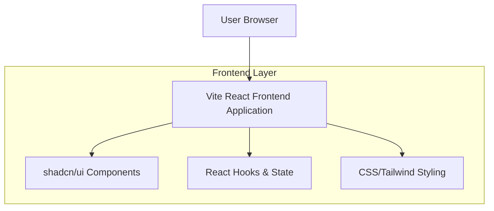
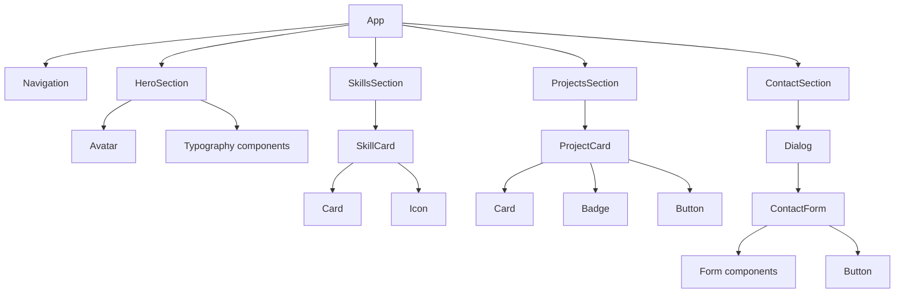

## 1. Architecture Design



## 2. Technology Description

- **Frontend**: React@18 + Vite + TypeScript
- **Styling**: TailwindCSS@3 + shadcn/ui components
- **Initialization Tool**: vite-init
- **Backend**: None (static portfolio site)
- **Deployment**: Static hosting (Vercel, Netlify, or GitHub Pages)

## 3. Route Definitions

| Route | Purpose |
|-------|---------|
| / | Single-page portfolio with all sections |

## 4. Component Architecture

### 4.1 Core Components
```typescript
// Main App Component
App.tsx - Root component with section management

// Section Components
HeroSection.tsx - Personal introduction and avatar
SkillsSection.tsx - Programming languages showcase
ProjectsSection.tsx - Project cards display
ContactSection.tsx - Contact form and social links
Navigation.tsx - Smooth scrolling navigation

// UI Components (shadcn/ui)
Card.tsx - Project and skill cards
Button.tsx - Interactive buttons
Dialog.tsx - Contact form modal
Form.tsx - Contact form fields
Badge.tsx - Technology badges
Avatar.tsx - Profile image
```

### 4.2 Data Structures

```typescript
// Project Interface
interface Project {
  id: string;
  title: string;
  description: string;
  technologies: string[];
  githubUrl: string;
  liveUrl?: string;
  imageUrl?: string;
}

// Skill Interface
interface Skill {
  name: string;
  icon: string;
  proficiency: 'Beginner' | 'Intermediate' | 'Advanced' | 'Expert';
  category: 'Frontend' | 'Backend' | 'Database' | 'Tools';
}

// Contact Form Interface
interface ContactForm {
  name: string;
  email: string;
  subject: string;
  message: string;
}
```

## 5. Component Hierarchy



## 6. State Management

```typescript
// Navigation State
interface NavigationState {
  activeSection: string;
  isMenuOpen: boolean;
}

// Contact Modal State
interface ContactModalState {
  isOpen: boolean;
  isSubmitting: boolean;
  formData: ContactForm;
}

// Projects State
interface ProjectsState {
  projects: Project[];
  filter: string;
}
```

## 7. Styling Architecture

- **TailwindCSS Configuration**: Custom color palette and spacing
- **Component Variants**: Using shadcn/ui variant system
- **Responsive Design**: Mobile-first breakpoints
- **Animations**: CSS transitions and React transition hooks
- **Dark Theme**: Consistent dark color scheme with gradient accents

## 8. Performance Optimization

- **Code Splitting**: Lazy loading for heavy components
- **Image Optimization**: WebP format with fallbacks
- **Bundle Size**: Tree shaking and minimal dependencies
- **Caching**: Service worker for offline functionality
- **SEO**: Meta tags and structured data

## 9. Development Setup

```bash
# Project initialization
npm create vite@latest portfolio --template react-ts
cd portfolio

# Install dependencies
npm install -D tailwindcss postcss autoprefixer
npx tailwindcss init -p

# Install shadcn/ui
npx shadcn-ui@latest init

# Add required components
npx shadcn-ui@latest add card button dialog form badge avatar
```

## 10. Deployment Configuration

- **Build Output**: Static files in `dist/` directory
- **Environment Variables**: None required for static deployment
- **Hosting**: Compatible with Vercel, Netlify, GitHub Pages
- **Domain**: Custom domain support available
- **SSL**: Automatic HTTPS with modern hosting providers